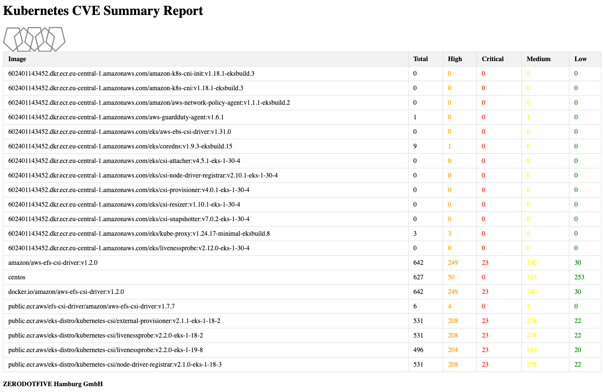

# Kubernetes CVE Analyser

A Python tool to scan Kubernetes container images for vulnerabilities using Trivy.

The Local Container Image CVE Scanner is a versatile tool designed for one-off usage to scan container images from a Kubernetes cluster and generate a comprehensive CVE (Common Vulnerabilities and Exposures) report. This tool is ideal for administrators and security professionals seeking to perform ad-hoc security assessments of their Kubernetes environments without the need for continuous monitoring.


## Features

- One-Time Scanning: Designed for one-off scans, this tool performs a thorough check of all container images in your Kubernetes cluster at the time of execution.
- CVE Detection: Identifies and reports known vulnerabilities in container images, referencing the latest CVE databases.
- Scans all images in a Kubernetes cluster
- Generates detailed and summary CSV reports
- Creates an HTML report with sortable tables and a company logo
- Filters out specific images based on provided substrings
- Local Execution: Runs locally on your machine, making it easy to use without requiring extensive setup or cloud-based services.
- Simple Integration: Easily integrates with your Kubernetes cluster to fetch and scan container images.


## Benefits
- Quick Assessments: Ideal for performing immediate and comprehensive security assessments of your container images.
- Enhanced Security: Helps ensure that container images are free from known vulnerabilities, reducing the risk of exploitation.
- Ease of Use: Simplifies the process of vulnerability scanning with a straightforward, locally executed tool.
- Cost-Effective: Eliminates the need for continuous monitoring solutions, providing a cost-effective approach to security checks.

## Usage Scenarios
- Ad-Hoc Security Audits: Conduct quick security audits of container images in your Kubernetes cluster whenever needed.
- Pre-Deployment Checks: Perform scans before deploying new applications or updates to ensure they do not introduce vulnerabilities.
- Incident Response: Quickly generate a CVE report during a security incident to identify and address vulnerabilities in container images.

## Prerequisites

Before running this tool, you need to install [Trivy](https://github.com/aquasecurity/trivy). Follow the steps below to install Trivy.

### Install Trivy
## Linux
# Install required packages:
sudo apt-get install wget apt-transport-https gnupg lsb-release

# Add Trivy's APT repository:
wget -qO - https://aquasecurity.github.io/trivy-repo/deb/public.key | sudo apt-key add -
echo deb https://aquasecurity.github.io/trivy-repo/deb $(lsb_release -sc) main | sudo tee -a /etc/apt/sources.list.d/trivy.list

# Update the package list and install Trivy:
sudo apt-get update
sudo apt-get install trivy

## macOS
# Install Trivy using Homebrew:
brew install aquasecurity/trivy/trivy

## Windows
# Install Trivy using Chocolatey:
choco install trivy
For other installation methods, refer to the [official Trivy documentation](https://github.com/aquasecurity/trivy#installation).

# Installation
Clone this repository and navigate to the project directory:
git clone https://github.com/yourusername/kubernetes-cve-analyser.git
cd kubernetes-cve-analyser

## Install the required Python packages:
```bash
pip install -r requirements.txt
```

# Usage
Ensure Trivy is installed and available in your PATH.

Run the script:

```bash
python src/main.py
```

# Configuration
Update the substrings_to_ignore variable in src/main.py to specify the substrings to filter out:

substrings_to_ignore = ["1234567890", "another_substring"]

By using the Local Container Image CVE Scanner, you can efficiently perform one-time security assessments of your Kubernetes cluster, ensuring that your container images are secure and up-to-date with the latest vulnerability information.



# Author
ZERODOTFIVE Hamburg GmbH

# Documentation
https://medium.com/@ayoubumoru/scanning-your-kubernetes-cluster-for-cves-with-trivy-by-using-kubernetes-cve-analyser-dcf9c0e47cbd
